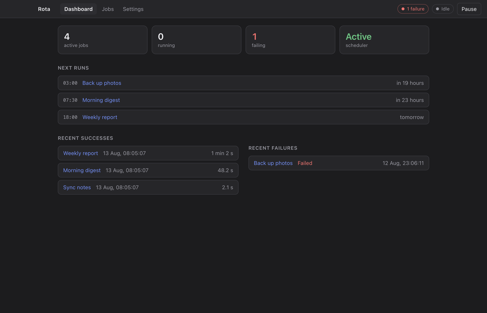
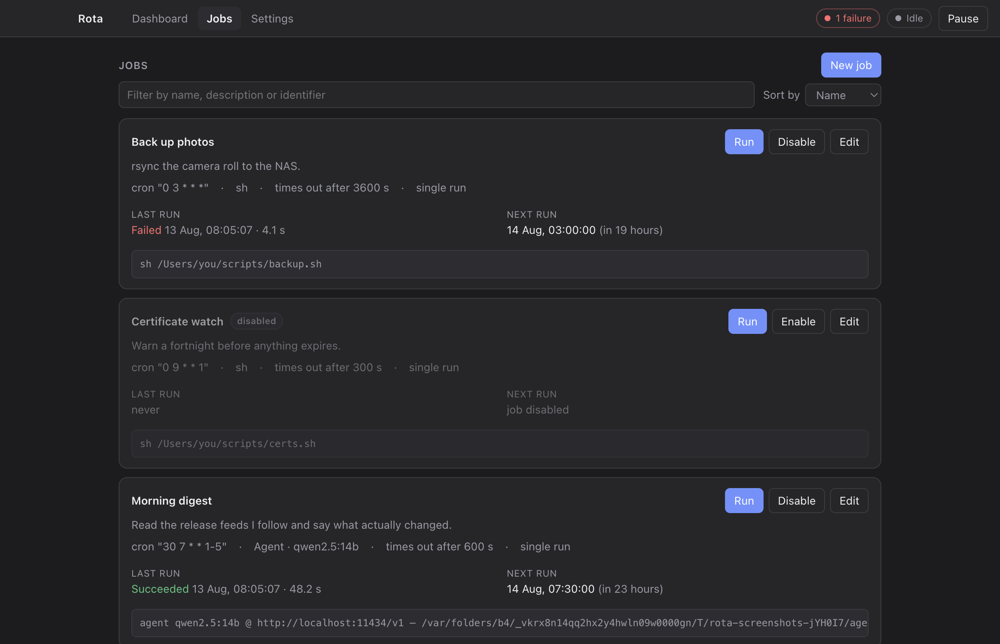
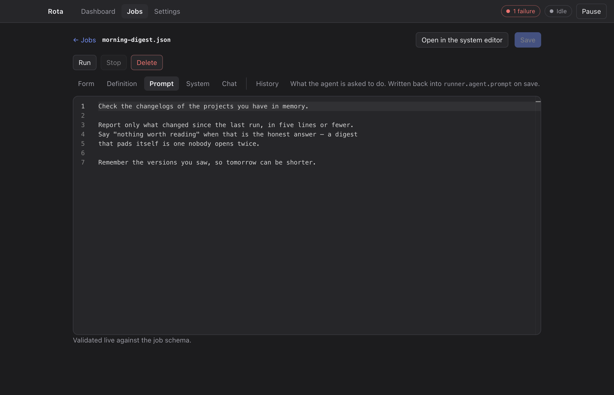
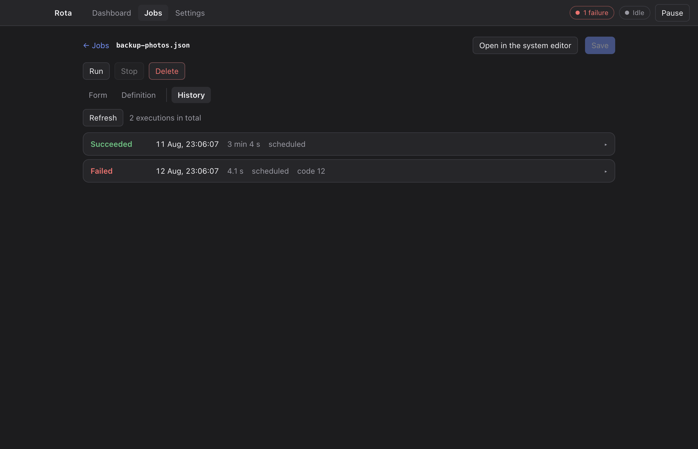

# Rota

**Recurring local automation and agent work on your own machine.**

A job is a script to run, or a paragraph describing what you want achieved. The
second kind is handed to a model with tools: it can read and write files in its own
directory, run commands, fetch pages, call MCP servers, remember what it learned last
time, and come back and ask you a question if it needs one. Both kinds are ordinary
jobs — same schedule, same history, same notification when they break.

Nothing leaves the machine unless you send it there. The model can be
[Ollama](https://ollama.com) on localhost; the configuration is a directory of JSON
files you can read, edit and track in Git. No server, no account, no telemetry.

[](https://github.com/mathieuancelin/rota/actions/workflows/ci.yml)
[](LICENSE)
[](#three-shapes-one-engine)
[](.nvmrc)

> **Status.** Works, used daily, single-machine scale.

## Three shapes, one engine

The scheduler is a library, not a window. Pick whichever shape suits the machine —
they run the same code, over the same configuration directory, and you can change
your mind later:

| | What it is | macOS | Linux |
|---|---|---|---|
| **Rota.app** | menu bar application: a real interface to write a job, watch it run, and put it right | ✅ Apple Silicon and Intel | ✅ x64, with one caveat below |
| **`rotad`** | the same engine with nobody attached — a headless box, a server, a Raspberry Pi | ✅ | ✅ arm64 and x64 |
| **`rotactl`** | the same engine from a terminal: list, validate, run, follow | ✅ | ✅ arm64 and x64 |

```sh
# A machine with no screen — no Node, no Bun, no runtime of any kind to install
rotad run --config-dir ~/.config/rota

# From anywhere, over SSH or not
rotactl jobs          # what exists, when it runs next, how it went last time
rotactl run backup    # start one now
rotactl events        # follow what happens, as it happens
```

`rotad` and `rotactl` are standalone binaries: everything they need is
compiled in. And the two shapes are not exclusive — the application can drive a
daemon instead of running its own scheduler, on this machine or another, and it
looks exactly the same from the window. That is also how an agent running headless
asks a question: it goes out over the event stream, and whichever interface is
attached opens the panel.

> **Where it is supported, honestly.** Everything here runs on macOS and Linux,
> arm64 and x64 — the daemon verified running a job on a bare Debian container with
> no runtime installed, the application verified starting, scheduling and running
> one on the same. Windows is not supported at all.
>
> **The one caveat, and it is not ours to fix: GNOME has shipped no system tray
> since version 3.** With an [AppIndicator
> extension](https://extensions.gnome.org/extension/615/appindicator-support/) the
> icon appears and everything behaves as on any other desktop; without one it does
> not, and a menu bar application on a desktop with no menu bar is a fair thing to
> be annoyed about. Closing the window is not a trap either way — the scheduler
> keeps running, and starting Rota again brings the window back. KDE, XFCE,
> Cinnamon and Budgie carry a tray natively.

## What it looks like

The interface exists for one reason: a job that quietly stopped working is worth
noticing before whatever it was keeping up to date turns out to be a month stale.



*What broke, and when it next tries. The screen you land on.*

| | |
|---|---|
| [](docs/images/jobs.png) | **Every job, with the command it will actually run** — its triggers, its next occurrence, how it went last time, and the exact command line. That last one is what you want the moment it misbehaves. |
| [](docs/images/agent-job.png) | **A job described rather than scripted.** A paragraph and a model. It has tools, it keeps a memory between runs, and it reports like any other job. |
| [](docs/images/history.png) | **The record a diagnosis comes from.** Every execution kept with its output, its duration and its exit code — 500 of them by default, which is what made the story below provable. |

<sub>Sample jobs and an invented history: a picture of the interface, not a record of
anything that ran. Taken from the real application by
<a href="packages/app/scripts/screenshots.js"><code>packages/app/scripts/screenshots.js</code></a> —
a script rather than four files somebody dragged in, so that they can be retaken
when the interface moves instead of quietly going stale.</sub>

## Documentation

The README is the tour. Three documents carry the rest, split by what you are doing:

- **[Writing a job](docs/jobs.md)** — triggers, the five kinds of runner, agents and
  their tools and memory, chaining, the Docker sandbox, and when you get notified.
  The reference to keep open while writing one.
- **[Running it](docs/operating.md)** — where the files live, the daemon and its
  service unit, the command line, the HTTP API, the Discord bridge, and what the
  security defaults actually are.
- **[Inside it](docs/internals.md)** — the four packages, how to build and test,
  how a release is cut, and what the abandoned Rust port proved.

## Why not cron?

A fair question: for "run this script every five minutes", `crontab` does the job in
one line, and it has been doing it for forty years.

Scheduling is not the hard part. **What happens when a job breaks** — and whether you
notice — is.

The example job in this repository, which keeps a Git-backed notes vault in sync,
once spent four hours failing on this:

```text
git@github.com: Permission denied (publickey).
```

The cause had nothing to do with Git. The SSH key was not loaded into `ssh-agent`, so
`ssh` decrypted it on every run by reading its passphrase from the keychain —
unreadable while the screen is locked. The diagnosis came down to one thing: 53
timestamped executions with their `stderr`, cross-referenced against screen-lock
events in the log. 45 failures, 8 successes, **every failure with the screen locked,
every success with it unlocked, no counter-example**.

Under `crontab`, that evidence does not exist. `stderr` goes to a local mail spool
nobody reads. You find out days later, when the repository turns out to be stale.

Worse: the cron daemon runs outside the graphical session, with a minimal
environment — **no `SSH_AUTH_SOCK`**. That job would have failed 100% of the time
rather than 40%. Rota passes the variable through explicitly, from an allowlist
([`packages/core/src/runner/index.js`](packages/core/src/runner/index.js)).

| | `crontab` | `launchd` | Rota |
|---|---|---|---|
| Time expressions | yes | intervals | yes, five fields |
| Catch-up after sleep | no | once on wake | once, can be disabled |
| Skip while the screen is locked | no | no | `requiresUnlockedSession` |
| Output kept and browsable | local mail | a file you manage | JSONL history + UI |
| Timeout, descendants killed | no | `ExitTimeOut` | SIGTERM then SIGKILL of the group |
| Notification on failure | no | no | yes, with the details one click away |
| Controlled environment | minimal | declarative | allowlist + per-job variables |

**Where `crontab` still wins:** it is already installed, it does not drag a hundred
megabytes of Chromium cache behind it, it needs no packaging, and forty years of use
have taken its bugs out. Rota understands the same expressions, but through its
own parser — young, and therefore less battle-tested than Vixie's.

**So the right tool depends on the job.** A nightly `rsync` that needs nothing and
that nobody watches: `crontab`, no hesitation. A job that touches the network,
credentials, or files you would rather not lose, and that you want to know has
stopped working: that is what Rota is for.

## Requirements

**To run it: nothing.** `rotad` and `rotactl` are standalone binaries, and
the `.dmg` carries its own Electron. There is no runtime to install first.

Per feature, and only if you use it:

- **[Bun](https://bun.sh)** for `bun` and `bun-inline` jobs — jobs written in
  JavaScript. `shell` jobs need nothing
- **An OpenAI-compatible API** for `agent` jobs — [Ollama](https://ollama.com) on
  localhost by default, with a model that can call tools. A hosted API works too,
  and then the prompt does leave the machine
- **[Docker](https://www.docker.com)** for the sandbox, whatever the job type

**To build it from source:** Node 22 (`nvm use` reads [`.nvmrc`](.nvmrc)) and
[Bun](https://bun.sh) for the compiled binaries.

## Getting started

Everything is on the [releases page](../../releases). Whichever you take, they all
open the same `~/.config/rota`, so starting with one and moving to another costs
nothing.

**The application, on macOS.** Download the `.dmg` for your machine, drag it to
Applications. It is ad-hoc signed and not notarized, so the first launch is
right-click → Open. It carries a matching `rotad` inside, at
`Contents/Resources/rotad`, for the day you want the scheduler to keep running
without a window.

**The daemon and the command line, anywhere.** No runtime to install first:

```bash
tar -xzf rotad-0.1.0-linux-x64.tar.gz
sudo install rotad-0.1.0-linux-x64/rotad /usr/local/bin/
rotad run --config-dir ~/.config/rota

# and to have the init system start it — this prints the file, and installs nothing
rotad service systemd > ~/.config/systemd/user/rotad.service
rotad service launchd > ~/Library/LaunchAgents/com.rota.daemon.plist
```

**One engine per configuration directory.** The first to open one takes a lock on
it, and a second refuses by name and by process id — an application and a daemon on
the same directory would otherwise run every job twice, with nothing to tell you but
a job that ran twice at three in the morning.

## Scope and non-goals

Rota schedules local jobs on one machine, for one user. It deliberately does not
try to be:

- **a distributed scheduler** — no remote workers, no cluster, no coordination
  protocol;
- **a multi-user service** — there is no authentication, and the Discord bridge is
  gated by channel access alone;
- **a CI system** — no build matrix, no artifacts, no pipeline model beyond one job
  triggering another;
- **a cloud product** — nothing leaves the machine except what a job explicitly
  sends.

Where this document calls something a limitation, it is a decision rather than an
oversight — the reasoning is given on the spot.

## Contributing

Issues and pull requests are welcome. Before opening a PR:

1. `npm test` must pass.
2. New behaviour that can regress silently comes with a test.
3. Comments explain *why*, not *what* — the codebase is consistent about this, and
   the surrounding style is the reference.

On language: everything is in English — the user interface, this document, what the
application prints, and the code comments. The comments were French until the
codebase grew past the point where that was a reasonable thing to ask of a
contributor.

## License

MIT — see [LICENSE](LICENSE).
